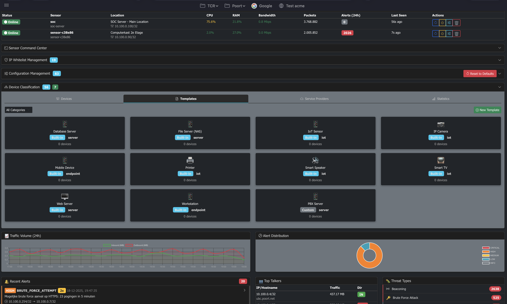

# Network Monitor - Security Operations Center (SOC)

Een krachtig netwerk monitoring platform voor Linux met **real-time web dashboard** dat verdacht netwerkverkeer kan detecteren. **Speciaal ontworpen voor monitoring van intern verkeer** om gecompromitteerde machines te detecteren. Geschikt voor gebruik op een monitoring/span port van een switch.

📚 **[Complete Documentation Index](docs/INDEX.md)** | 🚀 [Quick Start](#-quick-start-installation) | 📖 [User Manual](docs/usage/USER_MANUAL.md) | 🛠️ [Admin Manual](docs/usage/ADMIN_MANUAL.md)


*Real-time Security Operations Center dashboard voor netwerkmonitoring*

## 🎯 Key Features

### 🎛️ Centralized SOC Management
- **Remote sensor management** - Control alle sensors vanuit één dashboard
- **Configuration as Code** - Alle settings via GUI beheerbaar
- **AI Integration** - MCP server voor Claude Desktop integratie
- **Real-time synchronization** - Wijzigingen direct doorgevoerd
- **Device Classification** - ML-gebaseerde apparaatherkenning met behavior learning

### 🖥️ Real-Time Web Dashboard

**Professional SOC Dashboard op http://localhost:8080**

- **Live Alert Feed**: Real-time security alerts met kleuren en geluid
- **Traffic Visualisaties**: Grafieken en gauges voor verkeer monitoring
- **System Metrics**: CPU, Memory, Packets/sec, Alerts/min gauges
- **Top Talkers**: IPs met meeste verkeer (inclusief hostnames)
- **WebSocket Updates**: Sub-seconde real-time updates
- **Dark Theme**: Professional security monitoring interface
- **Responsive Design**: Werkt op desktop, tablet en mobile

[Zie DASHBOARD.md voor complete dashboard documentatie →](docs/usage/DASHBOARD.md)

### 🎛️ Centralized Management & Control (Nieuw!)

**Complete SOC Management via Dashboard**

- **Configuration Management**:
  - Alle sensor parameters instelbaar via GUI (detection rules, thresholds, performance)
  - Global (alle sensors) of sensor-specific configuratie
  - Type-aware inputs (checkboxes voor booleans, number inputs, etc.)
  - Categorized tabs: Detection Rules, Thresholds, Alert Management, Performance
  - Reset to best practice defaults met confirmatie
  - Real-time sync: sensors updaten binnen 1-5 minuten (configureerbaar)

- **Whitelist Management**:
  - Centraal whitelist beheer via dashboard
  - Toevoegen/verwijderen van IP ranges (CIDR notatie)
  - Automatic sensor synchronization
  - Geen handmatige config edits meer nodig

- **Remote Command & Control**:
  - Verstuur commands naar sensors vanuit dashboard
  - Beschikbare commands: restart, update_whitelist, update_config, get_status
  - Command geschiedenis per sensor
  - Real-time status updates

- **Sensor Monitoring**:
  - Live sensor status (online/offline)
  - Real-time metrics: CPU, RAM, bandwidth per sensor
  - Last seen timestamps
  - Location tracking

- **🤖 MCP HTTP API** - Modern AI Integration (Nieuw!):
  - **Token-based authentication** - Veilige Bearer tokens per AI client
  - **Permission scopes** - read_only, read_write, admin
  - **Rate limiting** - Bescherming tegen misbruik
  - **52 AI tools** - Van monitoring tot configuratie, memory management en whitelist beheer
  - **Auto-documentatie** - OpenAPI/Swagger docs
  - **Multi-client support** - Meerdere AI's tegelijk
  - AI-assisted sensor management via natuurlijke taal
  - Volledige audit trail van alle AI acties

  **Installatie:**

  MCP API wordt geïnstalleerd via `install_complete.sh` (zie [Quick Start Installation](#-quick-start-installation)):
  ```bash
  sudo ./install_complete.sh
  # → Antwoord "Y" bij "MCP HTTP API Server? (y/N)"
  # → MCP_API_ENABLED=true wordt automatisch in .env gezet
  # → Service wordt gegenereerd en gestart
  ```

  Of handmatig na installatie:
  ```bash
  # 1. Enable in .env
  echo "MCP_API_ENABLED=true" >> /opt/netmonitor/.env

  # 2. Regenereer services
  cd /opt/netmonitor && sudo ./install_services.sh
  ```

  **Documentatie:** [MCP_HTTP_API.md](docs/features/MCP_HTTP_API.md) | API Docs: http://localhost:8000/docs

  **⚠️ Belangrijke wijziging:** De oude STDIO/SSE MCP implementatie is vervangen door een moderne HTTP REST API met volledige token authenticatie. Legacy files zijn verplaatst naar `mcp_server/legacy_stdio_sse/`

### ⚡ Performance Tuning

NetMonitor is volledig configureerbaar voor verschillende deployment scenario's:

#### 🎛️ Dashboard Server Performance

**Keuze: Embedded Flask vs Gunicorn** (via `.env`)
```bash
# Development/Testing (1-2 users)
DASHBOARD_SERVER=embedded

# Production (10+ users) ⭐ AANBEVOLEN
DASHBOARD_SERVER=gunicorn
DASHBOARD_WORKERS=4  # Pas aan op basis van CPU cores
```

**Performance Karakteristieken:**
- **Embedded**: ~10-20 concurrent users, 1 process, 350MB RAM
- **Gunicorn**: 100+ concurrent users, 4+ workers, 1GB RAM

📖 [Volledige Comparison Guide](docs/deployment/DASHBOARD_SERVER_COMPARISON.md)

#### 💾 Database Performance

**Keuze: SQLite vs PostgreSQL** (via `.env`)
```bash
# Standaard - Voor single server deployments
DB_TYPE=sqlite
SQLITE_PATH=/var/lib/netmonitor/netmonitor.db

# Enterprise - Voor distributed deployments + MCP API
DB_TYPE=postgresql
DB_HOST=localhost
DB_NAME=netmonitor
# + Connection pooling (config.yaml)
```

**Gebruik PostgreSQL voor:**
- 🔀 Multi-sensor deployments
- 🤖 MCP HTTP API integration
- 📊 >1M alerts per dag
- ⏱️ TimescaleDB time-series queries

#### 🔄 Sensor Sync Intervals

Alle sync intervals configureerbaar via dashboard **Settings > Performance**:
- `config_sync_interval` (default: 300s) - Hoe vaak sensors config ophalen
- `whitelist_sync_interval` (default: 300s) - Whitelist sync frequentie
- `metrics_interval` (default: 60s) - Metrics reporting frequentie
- `heartbeat_interval` (default: 30s) - Heartbeat signals
- `command_poll_interval` (default: 30s) - Command polling frequentie

**Voor snellere updates**: Zet config_sync_interval op 60s voor updates binnen 1 minuut!

#### 📝 Logging & Retention

**Log configuratie** (via `.env`):
```bash
LOG_LEVEL=INFO              # DEBUG voor troubleshooting (hogere I/O!)
LOG_DIR=/var/log/netmonitor
LOG_RETENTION_DAYS=30       # Automatic log cleanup
```

**Log Levels Impact:**
- `DEBUG`: Verbose, ~500MB/dag, alleen voor troubleshooting
- `INFO`: Normal, ~100MB/dag, production default ⭐
- `WARNING`: Minimal, ~20MB/dag, alleen errors

#### 🔍 Self-Monitoring

**SOC server zelf monitoren** (via `.env` + `config.yaml`):
```bash
# .env
SELF_MONITOR_ENABLED=true
SELF_MONITOR_INTERFACE=lo   # Loopback voor internal traffic
```

Detecteert threats op de SOC server zelf (bijv. compromise van monitoring systeem).

#### 🌐 MCP API Performance

**AI Integration configuratie** (via `.env`):
```bash
MCP_API_ENABLED=true
MCP_API_WORKERS=4           # Pas aan voor concurrent AI clients
MCP_API_PORT=8000
```

**Worker Guidelines:**
- 2-4 workers: 1-2 AI clients
- 8+ workers: 5+ concurrent AI clients

#### ⚙️ Threat Feed Updates

**Update frequentie** (via `.env`):
```bash
THREAT_FEED_UPDATE_INTERVAL=3600  # 1 uur (default)
# 1800 = 30 min (hogere API load)
# 7200 = 2 uur (lagere API load)
```

---

**🎯 Quick Tuning Recommendations:**

| Deployment | Dashboard | Database | Workers | Log Level |
|------------|-----------|----------|---------|-----------|
| Home Lab | embedded | sqlite | - | INFO |
| Small SOC (1-5 sensors) | gunicorn | sqlite | 4 | INFO |
| Medium SOC (5-20 sensors) | gunicorn | postgresql | 8 | INFO |
| Enterprise (20+ sensors) | gunicorn | postgresql | 16 | WARNING |

📖 Zie [Production Deployment Guide](docs/deployment/PRODUCTION.md) voor complete tuning guide.

---

## 📘 AI‑Integratie in NetMonitor

NetMonitor is ontworpen als een moderne netwerkbewakingssensor waarin AI‑ondersteuning vanaf de basis is meegenomen. De tool combineert real‑time pakketinspectie met een uitbreidbare AI‑laag die via het Model Context Protocol (MCP) kan communiceren met externe AI‑modellen. Hierdoor wordt NetMonitor niet alleen een detector, maar een AI‑gestuurde analyse‑ en besluitvormingsmodule binnen iedere netwerkbeveiligingsarchitectuur.

### 🤖 1. MCP‑gebaseerde AI‑architectuur

Het Model Context Protocol (MCP) is een open standaard die het mogelijk maakt voor AI‑modellen om op een veilige en gestandaardiseerde manier externe tools en gegevensbronnen aan te roepen. MCP is ontwikkeld om AI‑agents slimmer, contextbewuster en betrouwbaarder te maken door middel van uniforme integraties.

De MCP‑specificatie beschrijft o.a. gestandaardiseerde berichten zoals ListToolsRequest, CallToolRequest en ListResourcesRequest, waarmee AI‑modellen tooling kunnen ontdekken en aansturen. Deze berichten maken het mogelijk dat een AI‑model automatisch functionaliteit van externe applicaties gebruikt.

NetMonitor fungeert hierbij als een MCP‑server die meer dan 60 tools aanbiedt aan een AI‑model.

**Enkele voorbeelden van deze tools:**
- uitlezen van NetMonitor‑status
- ophalen van detectieresultaten
- aanpassen van thresholds
- beheren van whitelist/blacklist
- inspecteren van netwerkprofielen
- koppelen van templates aan nieuw gedetecteerde devices
- uitvoeren van diagnostiek, health‑checks en config‑analyses

Zo krijgt een AI‑model dezelfde bevoegdheden als een beheerder — maar dan sneller, nauwkeuriger en continu.

### 🧠 2. AI‑gestuurde analyse en alert‑prioritering

Waar traditionele IDS‑systemen vaak grote hoeveelheden ruwe alerts genereren, biedt de AI‑laag in NetMonitor een intelligente interpretatielaag die:

- alerts clustert tot begrijpelijke incidenten
- false positives automatisch kan herkennen en onderdrukken
- gedrag over langere tijd kan analyseren
- afwijkingen kan herkennen die buiten de menselijke intuïtie vallen
- netwerkprofielen kan opbouwen per device
- automatisch correlaties kan leggen (bijv. tussen DNS‑tunneling, port scanning en afwijkende packet sizes)

Dankzij MCP kan het AI‑model context ophalen direct uit de bronapplicatie (NetMonitor), net zoals beschreven in officiële documentatie over hoe MCP AI‑agents toegang geeft tot real‑world data en tooling.

Dit verandert NetMonitor in een autonoom systeem dat helpt bij echte besluitvorming.

### ⚙️ 3. Automatische finetuning van instellingen

NetMonitor bevat meer dan 300 parameters die het detectiegedrag bepalen (thresholds, timers, limieten, whitelists, profielen, packet‑regels etc.). Veel van deze instellingen vereisen fijnmazige tuning, wat in de praktijk zeer tijdrovend is.

Via MCP kan de AI:
- configuraties dynamisch analyseren
- optimale parameters voorstellen
- thresholds automatisch aanpassen op basis van verkeer
- nieuwe devices herkennen en automatisch templates koppelen

De MCP‑documentatie bevestigt dat AI‑modellen tools kunnen aanroepen, configuraties kunnen aanpassen en beveiligde "human‑in‑the‑loop"-confirmations kunnen uitvoeren.

Hierdoor wordt configuratiebeheer grotendeels geautomatiseerd.

### 🔐 4. Veilige on‑prem AI‑integratie via NetMonitor‑Chat

Omdat veel organisaties geen cloud‑AI mogen gebruiken, voorziet NetMonitor in NetMonitor‑Chat, een client‑side bridge tussen:
- een on‑prem AI‑server (zoals een lokaal Ollama‑model)
- de NetMonitor MCP‑omgeving

Hierdoor kan de AI de MCP‑tools gebruiken zonder dat data het interne netwerk verlaat.

Hoewel er online diverse MCP‑clients bestaan (zoals AgentAI, 5ire en desktop‑AI‑chatapplicaties), wordt NetMonitor‑Chat niet genoemd in externe lijsten zoals de officiële MCP‑clientcatalogus. Deze catalogus somt wél AI‑apps op die MCP ondersteunen, zoals 5ire en AgenticFlow, en beschrijft hoe zij tools via MCP kunnen aanroepen.

Dat maakt NetMonitor‑Chat een unieke oplossing op de markt.

### 🧩 5. Integraties met third‑party security platforms

NetMonitor kan samenwerken met bestaande security‑oplossingen zoals Wazuh, SIEM‑platformen of EDR‑systemen.

MCP‑gestuurde AI kan dan:
- alerts verrijken met context
- SIEM‑meldingen automatisch prioriteren
- correlaties leggen tussen NetMonitor‑events en Wazuh‑events

Dit sluit aan op de bredere trend dat AI‑agents via MCP externe security‑services kunnen aansturen, zoals ook mogelijk is via connectors en remote MCP‑servers in de officiële OpenAI‑gidsen.

### 🚀 Samenvatting AI‑Integratie

NetMonitor onderscheidt zich door AI‑integratie als eerste‑klas functie:

- MCP‑interface met >60 tools
- AI‑gestuurde alertverrijking & clustering
- automatische tuning van honderden parameters
- veilige koppeling met on‑prem AI (NetMonitor‑Chat)
- integratie met bestaande securityplatformen
- moderne, toekomstbestendige architectuur gebaseerd op open standaarden

In tegenstelling tot traditionele IDS‑systemen draait NetMonitor niet alleen detectie uit —
het werkt samen met AI om accurater, slimmer en autonomer beveiligingsinzichten te leveren.

---

## 🛡️ Complete Detection Capabilities

### 🎯 Threat Intelligence & Reputation

| Feature | Status | Beschrijving |
|---------|--------|--------------|
| **C&C Server Detection** | ✅ | Automatische detectie van communicatie met bekende Command & Control servers |
| **Malware Download Detection** | ✅ | Detecteert downloads van bekende malware distributie sites |
| **Threat Feed Integration** | ✅ | FeodoTracker, URLhaus, ThreatFox, SSL Blacklist (auto-update elk uur) |
| **AbuseIPDB Integration** | ✅ | Real-time IP reputation lookups (1000/dag gratis tier) |
| **IP Blacklist/Whitelist** | ✅ | Configureerbare IP lijsten via dashboard |

### 🔍 DNS Anomaly Detection

| Feature | Status | Beschrijving |
|---------|--------|--------------|
| **Long Queries** | ✅ | Detecteert verdacht lange DNS queries (>50 chars) |
| **High Query Rate** | ✅ | Abnormaal hoge DNS query frequentie (>150/min) |
| **DGA Detection** | ✅ | Domain Generation Algorithm detection met score threshold |
| **Subdomain Entropy** | ✅ | Shannon entropy analysis voor random subdomains |
| **Encoding Detection** | ✅ | Base64/Hex encoded data in DNS queries |
| **DNS on Non-Standard Port** | ✅ | DNS verkeer op andere poorten dan 53 (tunneling indicator) |

### 🧊 ICMP Anomaly Detection

| Feature | Status | Beschrijving |
|---------|--------|--------------|
| **Large Payloads** | ✅ | Echo Requests met grote payloads (>500 bytes) |
| **High Rate Detection** | ✅ | Abnormaal veel grote ICMP packets (>10/min) |
| **Payload Entropy** | ✅ | Entropy analysis van ICMP payload voor tunneling |
| **Encoding Detection** | ✅ | Detecteert encoded data in ICMP payloads |

### 🌐 HTTP/HTTPS Anomaly Detection

| Feature | Status | Beschrijving |
|---------|--------|--------------|
| **Excessive POST Requests** | ✅ | Data exfiltration via POST (>50 posts/5min) |
| **Suspicious User-Agents** | ✅ | Detecteert tools: python, curl, wget, sqlmap, nikto |
| **DLP Inspection** | ✅ | Credit cards, emails, SSN, API keys, private keys, AWS keys, JWT |
| **High Entropy Payloads** | ✅ | Encrypted data in plaintext HTTP (entropy >6.5) |
| **HTTP on Non-Standard Port** | ✅ | HTTP verkeer op ongebruikelijke poorten |

### 📧 SMTP/FTP Detection

| Feature | Status | Beschrijving |
|---------|--------|--------------|
| **Large Email Attachments** | ✅ | SMTP transfers >50 MB/5min |
| **Large FTP Transfers** | ✅ | FTP transfers >50 MB/5min |
| **FTP on Non-Standard Port** | ✅ | FTP verkeer op andere poorten dan 20/21 |

### 🔐 Authentication & Brute Force

| Feature | Status | Beschrijving |
|---------|--------|--------------|
| **Brute Force Detection** | ✅ | Herhaalde login pogingen (SSH, RDP, FTP, Telnet, MySQL, PostgreSQL, VNC) |
| **SSH on Non-Standard Port** | ✅ | SSH verkeer op andere poorten dan 22 (backdoor indicator) |
| **Failed Login Tracking** | ✅ | Threshold: 5 attempts / 5 minuten (configureerbaar) |

### 🎭 Behavior-Based Detection

| Feature | Status | Beschrijving |
|---------|--------|--------------|
| **Beaconing Detection** | ✅ | C2 callbacks met regelmatige intervals (>70% consistentie) |
| **Outbound Volume Anomalies** | ✅ | Data exfiltration (>100 MB/5min threshold) |
| **Lateral Movement** | ✅ | Interne scanning (SMB/RDP/SSH/WinRM poorten) |
| **Port Scanning** | ✅ | Systematisch scannen (>20 unieke poorten/min) |
| **Connection Floods** | ✅ | SYN floods (>100 connections/sec) |
| **Unusual Packet Sizes** | ✅ | Abnormaal grote packets (>1400 bytes) |

### 🔬 Content Analysis

| Feature | Status | Beschrijving |
|---------|--------|--------------|
| **Entropy Checks** | ✅ | Shannon entropy calculation voor encrypted/compressed data |
| **DLP Inspection** | ✅ | 7+ gevoelige data patterns (credit cards, SSN, API keys, etc.) |
| **Payload Analysis** | ✅ | Deep packet inspection voor HTTP/ICMP |
| **Encoding Detection** | ✅ | Base64 en Hexadecimal encoding detection |

### 🚫 Protocol Mismatch Detection

| Feature | Status | Beschrijving |
|---------|--------|--------------|
| **HTTP Non-Standard Port** | ✅ | HTTP op andere poorten dan 80, 443, 8080, 8443 |
| **SSH Non-Standard Port** | ✅ | SSH op andere poorten dan 22 |
| **DNS Non-Standard Port** | ✅ | DNS op andere poorten dan 53 |
| **FTP Non-Standard Port** | ✅ | FTP op andere poorten dan 20/21 |

### 🤖 Device Classification & Behavior Learning

| Feature | Status | Beschrijving |
|---------|--------|--------------|
| **Device Discovery** | ✅ | Automatische detectie van apparaten via ARP/IP packets met OUI vendor lookup |
| **Behavior Learning** | ✅ | Traffic patronen analyseren en leren per apparaat (poorten, protocollen, volumes) |
| **ML Device Classification** | ✅ | Random Forest classifier voor automatische apparaattype herkenning (11 types) |
| **ML Anomaly Detection** | ✅ | Isolation Forest voor gedragsafwijkingen detectie per device |
| **Template-Based Classification** | ✅ | Apparaten koppelen aan device templates (IP Camera, Smart TV, Server, etc.) |
| **Alert Suppression** | ✅ | Verwacht gedrag per apparaattype niet als alert tonen (nooit voor CRITICAL/C2/Threats) |
| **Service Provider Detection** | ✅ | Streaming/CDN verkeer herkennen (Netflix, Spotify, YouTube, etc.) |
| **Auto Template Generation** | ✅ | Templates automatisch genereren uit geleerd apparaatgedrag |
| **Auto-Training** | ✅ | ML modellen automatisch trainen en classificaties toepassen (24-uurs cyclus) |

### 🔐 TLS/HTTPS Analysis (Metadata, geen decryptie)

| Feature | Status | Beschrijving |
|---------|--------|--------------|
| **JA3 Fingerprinting** | ✅ | Unieke TLS client fingerprints voor malware detectie (Cobalt Strike, Metasploit, etc.) |
| **JA3S Fingerprinting** | ✅ | Server-side TLS fingerprints voor C2 server detectie |
| **SNI Extraction** | ✅ | Server Name Indication uit TLS handshake voor domain visibility |
| **Certificate Validation** | ✅ | Expired, self-signed en verdachte certificaten detecteren |
| **Deprecated TLS Detection** | ✅ | TLS 1.0/1.1 en zwakke cipher suites detecteren |
| **Malware JA3 Blacklist** | ✅ | Ingebouwde blacklist voor bekende malware fingerprints |
| **ESNI/ECH Detection** | ✅ | Encrypted SNI en Encrypted Client Hello detectie (privacy/evasion) |
| **Domain Fronting Detection** | ✅ | SNI vs certificate mismatch detectie (C2 evasion techniek) |
| **Weak Cipher Detection** | ✅ | NULL, DES, RC4, export cipher detectie |

### 🏰 Active Directory / Kerberos Attack Detection

| Feature | Status | Beschrijving |
|---------|--------|--------------|
| **Kerberoasting Detection** | ✅ | Detecteert TGS-REQ enumeration voor service accounts |
| **AS-REP Roasting Detection** | ✅ | Detecteert accounts zonder pre-authentication |
| **DCSync Detection** | ✅ | DRSUAPI replication requests van non-DC machines |
| **Pass-the-Hash Detection** | ✅ | NTLM authentication anomalieën naar meerdere hosts |
| **Golden/Silver Ticket Indicators** | ✅ | Ongebruikelijke ticket patronen en lifetimes |
| **Kerberos Downgrade Attack** | ✅ | Detecteert RC4/DES encryption downgrade |
| **Kerberos Brute Force** | ✅ | Pre-authentication failures tracking |

### 🔗 Kill Chain / Multi-Stage Attack Correlation

| Feature | Status | Beschrijving |
|---------|--------|--------------|
| **10-Stage Kill Chain Tracking** | ✅ | Reconnaissance → Impact stage correlatie |
| **MITRE ATT&CK Mapping** | ✅ | Automatische TTP identificatie per alert |
| **Attack Chain Detection** | ✅ | Correleert losse alerts tot attack chains |
| **Risk Score Calculation** | ✅ | Dynamische chain risk scoring |
| **Stage Progression Alerts** | ✅ | Waarschuwt bij attack chain progressie |
| **Temporal Correlation** | ✅ | Time-window based event correlatie |

### 📂 SMB/LDAP Deep Protocol Parsing

| Feature | Status | Beschrijving |
|---------|--------|--------------|
| **SMB1/2/3 Detection** | ✅ | Protocol versie detectie (SMB1 = deprecated warning) |
| **Admin Share Access** | ✅ | C$, ADMIN$, IPC$ share access detectie |
| **Sensitive File Access** | ✅ | NTDS.dit, SAM, SYSTEM, LSASS.dmp access detectie |
| **SMB Enumeration** | ✅ | Directory enumeration pattern detectie |
| **LDAP Sensitive Queries** | ✅ | userPassword, unicodePwd, adminCount queries |
| **SPN Enumeration** | ✅ | servicePrincipalName queries (Kerberoasting recon) |
| **LDAP Admin Enumeration** | ✅ | Domain admin account enumeration |

### 📊 Asset Risk Scoring

| Feature | Status | Beschrijving |
|---------|--------|--------------|
| **Dynamic Risk Scores** | ✅ | Real-time risk scores per asset (0-100) |
| **Time-Weighted Alerts** | ✅ | Recente alerts wegen zwaarder |
| **Asset Categorization** | ✅ | Critical/High/Medium/Low asset classificatie |
| **Risk Trend Analysis** | ✅ | Increasing/Stable/Decreasing trend tracking |
| **Attack Chain Integration** | ✅ | Kill chain involvement verhoogt risk |
| **Attacker/Victim Tracking** | ✅ | Rol-gebaseerde risk assessment |

### ⚡ SOAR - Security Orchestration, Automation and Response

| Feature | Status | Beschrijving |
|---------|--------|--------------|
| **Automated Playbooks** | ✅ | 5 default playbooks (critical threat, lateral movement, etc.) |
| **Alert Enrichment** | ✅ | GeoIP, device info, WHOIS enrichment |
| **Webhook Notifications** | ✅ | Slack/Teams/custom webhook integratie |
| **Dry-Run Mode** | ✅ | Veilig testen zonder echte blocking |
| **Approval Workflow** | ✅ | Optionele goedkeuring voor playbook execution |
| **IP Blocking** | ✅ | Automatische IP blocking (opt-in, rate limited) |
| **Rate Limiting** | ✅ | Automatische rate limiting responses |
| **Packet Capture Trigger** | ✅ | Automatische PCAP capture bij critical alerts |

### 📦 PCAP Forensics (NIS2 Compliant)

| Feature | Status | Beschrijving |
|---------|--------|--------------|
| **Ring Buffer** | ✅ | Continue packet buffer voor forensische capture |
| **Alert-Triggered Capture** | ✅ | Automatisch PCAP opslaan rond HIGH/CRITICAL alerts |
| **Sensor PCAP Upload** | ✅ | Sensors uploaden PCAP evidence naar centrale SOC server |
| **Flow Export** | ✅ | Specifieke flows exporteren naar PCAP |
| **Retention Management** | ✅ | Automatische cleanup met configureerbare retentie |

### 🎛️ Management & Monitoring Features

| Feature | Status | Beschrijving |
|---------|--------|--------------|
| **Device Classification** | ✅ | ML-gebaseerde apparaatherkenning met behavior learning en alert suppression |
| **Kiosk Mode** | ✅ | Full-screen SOC display met auto-refresh en responsive design |
| **Configuration Management** | ✅ | Alle detection rules via dashboard GUI (global + per-sensor) |
| **Whitelist Management** | ✅ | Centralized IP whitelist beheer via dashboard (CIDR support) |
| **Remote Sensor Management** | ✅ | Control, monitor en command sensors vanuit centrale dashboard |
| **Web Authentication** | ✅ | 2FA, session management, role-based access control |
| **Real-time Metrics** | ✅ | Live gauges voor CPU, RAM, packets/sec, alerts/min |
| **Traffic Visualization** | ✅ | Real-time grafieken (inbound/outbound, 24-uur historie) |
| **Top Talkers Tracking** | ✅ | Top 10 IPs met meeste verkeer (met hostname resolution) |
| **Alert Feed** | ✅ | Live security alerts met kleuren, audio, en severity filtering |
| **Self-Monitoring** | ✅ | SOC server kan zichzelf monitoren (detecteert compromise) |
| **WebSocket Updates** | ✅ | Sub-seconde real-time dashboard updates zonder polling |
| **Database Support** | ✅ | SQLite (standaard) en PostgreSQL/TimescaleDB (enterprise) |
| **MCP AI Integration** | ✅ | 37 AI tools via HTTP API met token auth en rate limiting |
| **Multi-Sensor Support** | ✅ | Centralized management van remote sensors |
| **Config as Code** | ✅ | YAML configuratie met validation en defaults |
| **Service Templates** | ✅ | Systemd service generation vanuit templates + .env |
| **Sensor Commands** | ✅ | Remote commands: restart, update_whitelist, update_config |
| **ETag Caching** | ✅ | Efficient config distribution (99% bandwidth reductie) |
| **GeoIP Support** | ✅ | Country-level IP geolocation voor alerts |

### 🔧 Algemene Features

- Real-time packet capture en analyse
- Configureerbare detection thresholds (alle via GUI aanpasbaar)
- Gekleurde console output met severity levels
- Gestructureerde logging naar file (JSON + text)
- Rate limiting om alert flooding te voorkomen
- Graceful shutdown bij SIGINT/SIGTERM
- Virtual environment support (isolatie van dependencies)
- Template-based service generation (.env driven)
- Automatic database migrations
- Hot-reload van configuratie (sensors binnen 1-5 min)

## Vereisten

- Linux systeem met root/sudo privileges
- Python 3.7 of hoger
- libpcap (meestal standaard geïnstalleerd)

## 🚀 Quick Start Installation

### Complete Installatie (Aanbevolen - 1 Script)

**Alles in één keer: PostgreSQL, TimescaleDB, NetMonitor, Web Auth, MCP API**

```bash
# 1. Clone repository naar /opt
cd /opt
sudo git clone <repository-url>
cd netmonitor

# 2. Run complete installation script
sudo ./install_complete.sh
# → Interactive prompts voor:
#    - Database credentials (bestaande waarden worden voorgesteld)
#    - Network interface
#    - Internal network CIDR
#    - Componenten selectie
#    - Dashboard port
#    - MCP API configuratie
# → Installeert PostgreSQL + TimescaleDB
# → Maakt .env bestand aan (behoudt bestaande settings!)
# → Genereert services vanuit templates
# → Setup admin user voor dashboard
# → ~20-30 minuten installatie tijd

# 3. Klaar! Open dashboard
firefox http://localhost:8080
```

**✨ Voordelen:**
- ✅ **Slimme .env handling**: Bestaande waarden worden voorgesteld, ontbrekende worden toegevoegd
- ✅ **Alles geautomatiseerd**: Van database tot services
- ✅ **PostgreSQL + TimescaleDB**: Production-ready database setup
- ✅ **Template-based services**: Via install_services.sh met .env configuratie
- ✅ **Safe re-run**: Kan opnieuw uitgevoerd zonder bestaande settings te verliezen
- ✅ **Backup**: Automatische backup van config.yaml en .env

### Handmatige Installatie (Voor experts)

<details>
<summary>Klik hier voor stap-voor-stap handmatige installatie</summary>

```bash
# 1. Clone repository
git clone <repository-url>
cd netmonitor

# 2. Setup Python virtual environment (BELANGRIJK!)
./setup_venv.sh

# 3. Maak directories aan
sudo mkdir -p /var/log/netmonitor
sudo mkdir -p /var/cache/netmonitor/feeds
sudo mkdir -p /var/lib/netmonitor

# 4. Configureer .env (kopieer van .env.example)
sudo cp .env.example .env
sudo nano .env  # Pas aan naar je setup

# 5. Installeer systemd services (gebruikt .env en templates!)
sudo ./install_services.sh
# → Genereert services vanuit templates in services/ directory
# → Leest configuratie uit .env bestand
# → Vraagt welke services je wilt enablen

# 6. Klaar! Check status
sudo systemctl status netmonitor netmonitor-feed-update.timer
```

**Waarom virtual environment?**
- Isoleert Python dependencies
- Geen conflicts met system packages
- Geen sudo pip nodig
- MCP package alleen via pip beschikbaar

</details>

Zie [VENV_SETUP.md](docs/installation/VENV_SETUP.md) voor details en [SERVICE_INSTALLATION.md](docs/installation/SERVICE_INSTALLATION.md) voor service management.

---

### Legacy Installatie (Niet aanbevolen)

<details>
<summary>Klik hier voor oude installatie methode (deprecated)</summary>

```bash
# Stap 1: Clone repository
git clone <repository-url>
cd netmonitor

# Stap 2: Installeer dependencies system-wide
sudo pip install -r requirements.txt

# Stap 3: Maak directories aan
sudo mkdir -p /var/log/netmonitor /var/cache/netmonitor/feeds /var/lib/netmonitor

# Stap 4: Download threat feeds
sudo python3 update_feeds.py

# Stap 5: Setup services handmatig
sudo cp netmonitor-feed-update.service /etc/systemd/system/
sudo cp netmonitor-feed-update.timer /etc/systemd/system/
sudo systemctl daemon-reload
sudo systemctl enable netmonitor-feed-update.timer
sudo systemctl start netmonitor-feed-update.timer

# Verificeer
sudo systemctl status netmonitor-feed-update.timer
```

**⚠️ Nadelen van legacy methode:**
- MCP server werkt niet (MCP package niet beschikbaar via apt)
- System-wide pip vereist sudo
- Kan conflicten veroorzaken met system packages
- Services moeten handmatig geüpdate worden bij nieuwe Python versie

**Migreren naar venv:**
```bash
./setup_venv.sh
sudo ./install_services.sh
```

</details>

---

## Configuratie

Pas `config.yaml` aan naar je wensen:

### Network Interface

```yaml
interface: eth0  # Vervang met je monitoring interface (eth0, ens33, etc.)
```

Om alle interfaces te monitoren, gebruik:
```yaml
interface: any
```

### Internal Networks (BELANGRIJK!)

Definieer je interne netwerk ranges voor behavior detection:

```yaml
internal_networks:
  - 10.0.0.0/8
  - 172.16.0.0/12
  - 192.168.0.0/16  # Pas aan naar je netwerk
```

### Threat Intelligence Feeds

De tool gebruikt gratis threat feeds van abuse.ch. Geen API key nodig!

```yaml
threat_feeds:
  enabled: true
  feeds:
    - feodotracker    # Botnet C&C servers (AANBEVOLEN)
    - urlhaus         # Malware distribution
    - threatfox       # Recent IOCs
    - sslblacklist    # SSL threats
  update_interval: 3600  # 1 uur
```

### AbuseIPDB API (Optioneel)

Voor real-time IP reputation lookups:

1. Maak gratis account: https://www.abuseipdb.com/register
2. Haal API key op: https://www.abuseipdb.com/account/api
3. Configureer:

```yaml
abuseipdb:
  enabled: true
  api_key: "YOUR_API_KEY_HERE"
  rate_limit: 1000  # Gratis tier
  threshold: 50     # Alert bij score >= 50
```

Zie [THREAT_FEEDS.md](docs/features/THREAT_FEEDS.md) voor gedetailleerde documentatie.

### GeoIP Database (Aanbevolen)

Voor land-identificatie van IP-adressen in alerts. Zonder lokale database wordt een online API gebruikt (rate-limited).

**Optie 1: Automatisch script (db-ip.com - gratis)**

```bash
./download_geoip_db.sh
```

**Optie 2: MaxMind GeoLite2 (gratis account vereist)**

1. Registreer gratis: https://dev.maxmind.com/geoip/geolite2-free-geolocation-data
2. Download `GeoLite2-Country.mmdb`
3. Installeer:

```bash
sudo mkdir -p /var/lib/GeoIP
sudo mv GeoLite2-Country.mmdb /var/lib/GeoIP/
sudo chmod 644 /var/lib/GeoIP/GeoLite2-Country.mmdb
```

**Optie 3: geoipupdate (automatische updates)**

```bash
sudo apt-get install geoipupdate
# Configureer /etc/GeoIP.conf met MaxMind account ID en license key
sudo geoipupdate
# Voeg toe aan cron voor automatische updates
```

Na installatie: `sudo systemctl restart netmonitor-dashboard`

De database wordt automatisch gevonden in:
- `/var/lib/GeoIP/GeoLite2-Country.mmdb`
- `/usr/share/GeoIP/GeoLite2-Country.mmdb`

### MAC Vendor Database (OUI)

Voor betere apparaatherkenning kan de OUI (Organizationally Unique Identifier) database worden bijgewerkt naar de volledige IEEE database met 30.000+ vendors.

**Update de OUI database:**

```bash
cd /opt/netmonitor
source venv/bin/activate
python update_oui_database.py
```

Dit script:
- Download de officiële IEEE OUI database
- Valt terug naar Wireshark's manuf file als backup
- Voegt extra IoT vendors toe (Sonos, Philips Hue, Shelly, etc.)
- Slaat op naar `data/oui_database.json`

**Automatische updates (optioneel):**

```bash
# Voeg toe aan crontab voor maandelijkse updates
0 3 1 * * cd /opt/netmonitor && ./venv/bin/python update_oui_database.py --quiet
```

### Detection Thresholds Aanpassen

Je kunt de gevoeligheid van elke detector aanpassen:

```yaml
thresholds:
  # Signature-based
  port_scan:
    enabled: true
    unique_ports: 20
    time_window: 60

  # Behavior-based (NIEUW!)
  beaconing:
    enabled: true
    min_connections: 5
    max_jitter_percent: 20

  lateral_movement:
    enabled: true
    unique_targets: 5
    time_window: 300

  outbound_volume:
    enabled: true
    threshold_mb: 100
    time_window: 300
```

### Whitelist/Blacklist

Voeg vertrouwde netwerken toe aan whitelist:

```yaml
whitelist:
  - 192.168.1.0/24      # Je eigen netwerk
  - 10.0.0.0/8          # Intern netwerk
```

Voeg bekende malicious IPs toe aan blacklist:

```yaml
blacklist:
  - 203.0.113.0/24      # Bekend malicious netwerk
  - 198.51.100.50       # Specifiek IP
```

## 🚀 Gebruik

### Start Network Monitor + Web Dashboard

Run als root (vereist voor packet capture):

```bash
sudo python3 netmonitor.py
```

**Output:**
```
Network Monitor geïnitialiseerd
Database Manager enabled
Metrics Collector enabled
Threat Feed Manager enabled
Behavior Detector enabled
Web Dashboard enabled
Dashboard beschikbaar op: http://0.0.0.0:8080
Starting network monitor op interface: eth0
```

### Open Web Dashboard

**Lokale toegang:**
```
http://localhost:8080
```

**Remote toegang (vanaf andere machine):**
```
http://192.168.1.X:8080  # Vervang X met server IP
```

### Dashboard Features

✅ **Live Alert Feed** - Real-time security alerts
✅ **Traffic Graphs** - 24-uur inbound/outbound charts
✅ **System Gauges** - Packets/sec, Alerts/min, CPU, Memory
✅ **Top Talkers** - IPs met meeste verkeer
✅ **Threat Types** - Meest voorkomende threats
✅ **Audio Alerts** - Beep bij CRITICAL/HIGH alerts

[→ Complete Dashboard Documentatie (DASHBOARD.md)](docs/usage/DASHBOARD.md)

### Command Line Opties

```bash
# Met specifieke interface
sudo python3 netmonitor.py -i eth0

# Met custom config file
sudo python3 netmonitor.py -c /path/to/config.yaml

# Verbose mode (debug)
sudo python3 netmonitor.py -v
```

### Standalone Dashboard (Zonder Monitoring)

Voor testing of development:

```bash
sudo python3 web_dashboard.py
```

### Stoppen

Druk op `Ctrl+C` voor graceful shutdown.

## Command Line Opties

```
usage: netmonitor.py [-h] [-c CONFIG] [-i INTERFACE] [-v]

options:
  -h, --help            Toon help bericht
  -c CONFIG, --config CONFIG
                        Pad naar configuratie file (default: config.yaml)
  -i INTERFACE, --interface INTERFACE
                        Network interface om te monitoren (overschrijft config file)
  -v, --verbose         Verbose output (DEBUG level)
```

## Output en Logging

### Console Output

Alerts worden real-time getoond in de console met kleuren:
- **ROOD**: HIGH/CRITICAL severity
- **GEEL**: MEDIUM severity
- **CYAAN**: LOW severity

### Voorbeeld Alerts

**C&C Communicatie (KRITISCH!):**
```
[2025-11-06 15:30:45] [CRITICAL] [C2_COMMUNICATION] Internal machine verbindt met C&C server: Emotet | Source: 192.168.1.100 | Destination: 203.0.113.50 | Malware: Emotet
```

**Beaconing Gedetecteerd:**
```
[2025-11-06 15:31:20] [HIGH] [BEACONING_DETECTED] Beaconing gedetecteerd: 8 connecties met avg interval 60.2s | Source: 192.168.1.50 | Destination: 198.51.100.100:443
```

**Lateral Movement:**
```
[2025-11-06 15:32:10] [HIGH] [LATERAL_MOVEMENT] Mogelijk lateral movement: 7 interne IPs gescand binnen 300s | Source: 192.168.1.75 | Protocols: SMB: 5, RDP: 2
```

**Data Exfiltration:**
```
[2025-11-06 15:33:00] [MEDIUM] [HIGH_OUTBOUND_VOLUME] Hoog outbound volume: 150.25 MB in 300s | Source: 192.168.1.100
```

**Port Scan:**
```
[2025-11-06 15:34:00] [HIGH] [PORT_SCAN] Mogelijk port scan gedetecteerd: 25 unieke poorten binnen 60s | Source: 192.168.1.100 | Destination: 10.0.0.50
```

### Log Files

Drie log files worden aangemaakt:

1. **Algemene logs**: `/var/log/netmonitor/alerts.log`
   - Alle system events en errors

2. **Security alerts**: `/var/log/netmonitor/security_alerts.log`
   - Alleen security threats

3. **Feed updates**: `/var/log/netmonitor/feed_updates.log`
   - Threat feed download status

### Database

Alerts en metrics worden opgeslagen in PostgreSQL database met TimescaleDB extensie:

**Default Location**: `localhost:5432/netmonitor`

**Main Tables**:
- `alerts` - Alle security alerts met metadata (TimescaleDB hypertable)
- `traffic_metrics` - Traffic statistieken per minuut
- `top_talkers` - Top IPs per 5 minuten
- `system_stats` - System resource metrics
- `sensors` - Remote sensor registratie en status
- `sensor_metrics` - Sensor performance metrics (CPU, RAM, bandwidth)
- `whitelist` - Centralized IP whitelist management

**Setup**: Zie [POSTGRESQL_SETUP.md](docs/installation/POSTGRESQL_SETUP.md) en [TIMESCALEDB_SETUP.md](docs/installation/TIMESCALEDB_SETUP.md) voor installatie instructies.

Toegang via web dashboard of direct via API.

## Monitoring Port Setup

**📘 Uitgebreide Switch Configuratie Guide:** Zie [docs/architecture/SWITCH_MIRROR_CONFIGURATION.md](docs/architecture/SWITCH_MIRROR_CONFIGURATION.md) voor gedetailleerde instructies per switch merk (Cisco, HPE, Ubiquiti, Mikrotik, Dell, Juniper, etc.)

### Switch Configuratie

Voor gebruik op een monitoring/span port, configureer je switch om verkeer te mirroren:

#### Cisco IOS Voorbeeld

```
configure terminal
monitor session 1 source interface GigabitEthernet0/1 both
monitor session 1 destination interface GigabitEthernet0/24
end
```

#### Linux Bridge Voorbeeld

```bash
# Stel port mirroring in met tc
tc qdisc add dev eth0 ingress
tc filter add dev eth0 parent ffff: protocol all u32 match u32 0 0 action mirred egress mirror dev eth1
```

### Interface in Promiscuous Mode

De tool zet de interface automatisch in promiscuous mode, maar je kunt dit ook manueel doen:

```bash
sudo ip link set eth0 promisc on
```

## 🔧 Troubleshooting

### Network Monitor Issues

#### "Permission Denied" Error

De tool vereist root privileges voor packet capture:

```bash
sudo python3 netmonitor.py
```

#### Interface Niet Gevonden

Controleer beschikbare interfaces:

```bash
ip link show
# of
ifconfig
```

Pas `interface` in `config.yaml` aan naar een bestaande interface.

#### Geen Packets Ontvangen

1. Check of interface UP is:
   ```bash
   sudo ip link set eth0 up
   ```

2. Check of er daadwerkelijk verkeer is:
   ```bash
   sudo tcpdump -i eth0 -c 10
   ```

3. Bij monitoring port: check switch configuratie

#### Te Veel False Positives

Pas detection thresholds aan in `config.yaml`:
- Verhoog `unique_ports` voor port scan detectie
- Verhoog `connections_per_second` voor flood detectie
- Voeg interne netwerken toe aan whitelist

### Web Dashboard Issues

#### Dashboard Niet Toegankelijk

```bash
# Check of Flask server draait
ps aux | grep web_dashboard

# Check of port open is
netstat -tulpn | grep 8080

# Check firewall
sudo ufw status
```

**Oplossing:** Open port in firewall:
```bash
sudo ufw allow 8080/tcp
```

#### WebSocket Verbinding Mislukt

Check browser console (F12):
```
WebSocket connection failed
```

**Oplossing:**
- Check firewall toestaat WebSocket traffic
- Check `host` setting in config.yaml (gebruik 0.0.0.0 voor remote access)

#### Geen Alerts op Dashboard

```bash
# Check database
psql -U netmonitor -d netmonitor -c "SELECT COUNT(*) FROM alerts;"

# Check logs
tail -f /var/log/netmonitor/alerts.log

# Restart monitor
sudo pkill -f netmonitor.py
sudo python3 netmonitor.py
```

#### Charts Laden Niet

1. Open browser console (F12) en check voor JavaScript errors
2. Check of Chart.js CDN beschikbaar is
3. Check internet connectie (voor CDN resources)
4. Try hard refresh: Ctrl+Shift+R

#### Database Errors

```bash
# Check permissions
ls -la /var/lib/netmonitor/

# Fix permissions
sudo chmod 755 /var/lib/netmonitor
sudo chmod 644 /var/lib/netmonitor/netmonitor.db

# Rebuild database (DANGER: verwijdert alle data)
sudo rm /var/lib/netmonitor/netmonitor.db
sudo python3 netmonitor.py
```

### Threat Feed Issues

Zie [THREAT_FEEDS.md](docs/features/THREAT_FEEDS.md) voor gedetailleerde troubleshooting.

## ⚡ Performance Consideraties

### Resource Gebruik

**Network Monitor:**
- CPU: 5-15% tijdens actieve monitoring (afhankelijk van verkeer)
- Memory: 200-500 MB (inclusief dashboard en database)
- Disk: ~10-50 MB/dag voor database (afhankelijk van alert volume)

**Web Dashboard:**
- CPU: 2-5% extra (Flask + WebSocket)
- Memory: ~100-200 MB extra
- Network: ~1-5 KB/sec (WebSocket overhead)

### Optimalisaties

- De tool gebruikt `store=0` bij packet capture om memory laag te houden
- Database gebruikt bounded deques voor memory-efficient tracking
- Metrics worden geaggregeerd voor minder database writes
- Charts updaten zonder volledige re-render
- Thread-safe database connections

### High Traffic Netwerken (>1Gbps)

Voor zeer drukke netwerken:

1. **BPF Filters**: Filter verkeer in scapy
```python
sniff(filter="tcp and not port 22")  # Skip SSH verkeer
```

2. **Sampling**: Monitor slechts percentage van verkeer
3. **Dedicated Hardware**: Gebruik dedicated monitoring machine
4. **Database**: Overweeg PostgreSQL voor grotere volumes

### Monitoring

Monitor de monitor zelf:
```bash
# Check resource usage
top -p $(pgrep -f netmonitor.py)

# Check database size
du -h /var/lib/netmonitor/netmonitor.db

# Check logs
tail -f /var/log/netmonitor/alerts.log
```

## Systemd Service (Optioneel)

Om de monitor automatisch te starten bij boot:

1. Maak service file `/etc/systemd/system/netmonitor.service`:

```ini
[Unit]
Description=Network Monitor - Threat Detection
After=network.target

[Service]
Type=simple
User=root
WorkingDirectory=/path/to/netmonitor
ExecStart=/usr/bin/python3 /path/to/netmonitor/netmonitor.py
Restart=on-failure
RestartSec=10

[Install]
WantedBy=multi-user.target
```

2. Enable en start service:

```bash
sudo systemctl daemon-reload
sudo systemctl enable netmonitor
sudo systemctl start netmonitor
```

3. Check status:

```bash
sudo systemctl status netmonitor
sudo journalctl -u netmonitor -f  # Live logs
```

## Security Overwegingen

- **Run als root**: Vereist voor raw packet access, maar wees voorzichtig
- **Log file permissions**: Zorg dat alleen root toegang heeft tot logs (kunnen gevoelige info bevatten)
- **Whitelist configuratie**: Voeg vertrouwde systemen toe om false positives te reduceren
- **Monitor de monitor**: Check periodiek of de tool nog draait en correct functioneert

## 🏗️ Architectuur

**📋 Production Deployment Guide:** Zie [ARCHITECTURE_BEST_PRACTICES.md](docs/architecture/ARCHITECTURE_BEST_PRACTICES.md) voor aanbevolen netwerk architectuur met dedicated monitoring hardware, VLAN segmentatie en port mirroring configuratie.

```
netmonitor.py              - Main entry point, packet capture loop
├── config_loader.py       - YAML configuratie laden
├── detector.py            - Signature-based threat detection
├── behavior_detector.py   - Behavior-based threat detection
├── threat_feeds.py        - Threat intelligence feed manager
├── abuseipdb_client.py    - AbuseIPDB API client
├── alerts.py              - Alert management en logging
├── database.py            - PostgreSQL/TimescaleDB database manager
├── metrics_collector.py   - Traffic & system metrics
├── web_dashboard.py       - Flask web server + WebSocket
└── web/                   - Dashboard frontend
    ├── templates/
    │   └── dashboard.html - Bootstrap 5 UI
    └── static/
        ├── css/dashboard.css
        └── js/dashboard.js    - Chart.js + WebSocket client
```

### Data Flow

```
1. Packet Captured (scapy)
   ↓
2. Metrics Collector (track traffic)
   ↓
3. Threat Detector (analyze)
   ├─→ Signature detection
   ├─→ Behavior detection
   └─→ Threat feed check
   ↓
4. Alert Found?
   ├─→ Console/File (AlertManager)
   ├─→ Database (PostgreSQL/TimescaleDB)
   └─→ WebSocket Broadcast (Dashboard)
   ↓
5. Dashboard Updates (real-time)
```

## 🌐 Web Dashboard

### Quick Access

Start monitor en open:
```
http://localhost:8080
```

### Dashboard Sections

**System Metrics** (Top Row)
- 🟢 **Packets/sec**: Real-time packet rate
- 🟡 **Alerts/min**: Security alert frequency
- 🔵 **CPU Usage**: Processor utilization
- 🟠 **Memory**: RAM usage

**Traffic Analysis** (Middle Row)
- 📈 **Traffic Volume**: 24-hour line chart (inbound vs outbound)
- 🥧 **Alert Distribution**: Pie chart by severity

**Live Feeds** (Bottom Row)
- 🔔 **Recent Alerts**: Last 50 alerts with severity colors
- 👥 **Top Talkers**: Top 10 IPs by traffic (with hostnames)
- 🐛 **Threat Types**: Most common threat types

### API Endpoints

```bash
# Get all dashboard data
curl http://localhost:8080/api/dashboard

# Get recent alerts
curl http://localhost:8080/api/alerts?limit=50&hours=24

# Get alert statistics
curl http://localhost:8080/api/alerts/stats

# Get traffic history
curl http://localhost:8080/api/traffic/history?hours=24

# Get top talkers
curl http://localhost:8080/api/top-talkers?limit=10
```

#### Configuration API (for Sensors)

**Get sensor configuration** (with ETag caching support):

```bash
# First request - get config with ETag
curl -H "Authorization: Bearer YOUR_SENSOR_TOKEN" \
     http://localhost:8080/api/config?sensor_id=sensor-001

# Response includes ETag header:
# ETag: "a1b2c3d4e5f6..."
# { "success": true, "config": { ... } }

# Subsequent requests - use If-None-Match header
curl -H "Authorization: Bearer YOUR_SENSOR_TOKEN" \
     -H "If-None-Match: \"a1b2c3d4e5f6...\"" \
     http://localhost:8080/api/config?sensor_id=sensor-001

# If config unchanged: 304 Not Modified (no body, saves bandwidth)
# If config changed: 200 OK with new config and new ETag
```

**ETag Benefits:**
- **Bandwidth savings**: 99% reduction after initial config load
- **Faster responses**: 304 returns immediately without database query
- **Automatic**: Sensors handle ETags automatically via `sensor_client.py`
- **Standard HTTP**: Uses well-tested HTTP caching mechanism

**Parameters:**
- `sensor_id`: Unique sensor identifier (optional, returns global config if omitted)
- `include_defaults`: Include default values (default: true for UI, false for sensors)

### Dashboard Configuration

In `config.yaml`:

```yaml
dashboard:
  enabled: true
  host: 0.0.0.0  # Toegankelijk vanaf alle interfaces
  port: 8080     # Dashboard port
  database_path: /var/lib/netmonitor/netmonitor.db
```

**Disable dashboard:**
```yaml
dashboard:
  enabled: false
```

**Custom port:**
```yaml
dashboard:
  port: 3000  # Of andere beschikbare port
```

### Remote Access

Om dashboard toegankelijk te maken vanaf andere machines:

1. **Firewall regel toevoegen:**
```bash
sudo ufw allow 8080/tcp
```

2. **Access URL:**
```
http://<server-ip>:8080
```

### Security (Production)

Voor productie gebruik, zie [DASHBOARD.md](docs/usage/DASHBOARD.md) voor:
- HTTPS/SSL setup met nginx
- Authentication (Basic Auth, OAuth)
- IP whitelisting
- Rate limiting

## 📊 Visualisaties

Het dashboard biedt verschillende visualisatie types:

### Gauge Charts (4x)
- **Type**: Doughnut gauges (180° arc)
- **Update**: Real-time, elk 5 seconden
- **Kleuren**: Color-coded per metric type

### Line Charts
- **Traffic Volume**: Dubbele lijn (inbound/outbound)
- **Historie**: 24 uur met uurlijkse data points
- **Smooth**: Tension curves voor vloeiende lijnen

### Pie Charts
- **Alert Distribution**: Severity breakdown
- **Dynamic**: Updates bij nieuwe alerts

### Tables
- **Top Talkers**: Sorteerbaar, met hostname resolution
- **Threat Types**: Top 10 met badge counts

## Licentie

Dit project is gelicenseerd onder de **GNU Affero General Public License v3.0 (AGPL-3.0-only)**.  
Bij distributie of bij **netwerkgebruik van een gewijzigde versie** ben je verplicht de volledige
broncode van die gewijzigde versie aan gebruikers beschikbaar te stellen (zie §13).  
[Zie het bestand LICENSE voor de volledige tekst →](LICENCE)

## Contributing

Als je wilt bijdragen of ideeen hebt neem gerust contact met me op.

## Contact

Willem M. Poort
willem@awimax.nl
+31 10 599 06 00 (09:00-17:00) (CET / Europe/Amsterdam)
